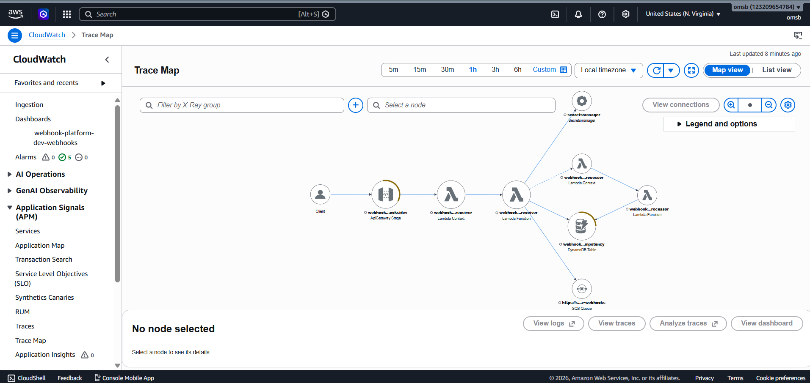

# Production Webhook Receiver & Async Job Processor on AWS

A copy-paste-ready prompt for AI coding agents (Claude Code, Cursor, Kiro) that generates a production-grade, multi-provider webhook ingestion system on AWS — signature verification, idempotency, async processing, dead-letter queues, full observability, and OIDC-based CI/CD — from a single prompt.

> **Submitted to the [AWS Prompt the Planet Challenge](https://dorahacks.io/) (DoraHacks × AWS Startups).**

---

## The problem

Every startup that integrates Stripe, GitHub, Slack, or any other webhook provider rewrites the same broken code on day one: no idempotency (provider retries cause duplicate side effects), naive signature verification (vulnerable to timing attacks or never run at all), synchronous handlers that exceed the provider's response timeout, and silent failures with no DLQ to recover from. The "correct" architecture is well-known to senior engineers but rarely written down in deployable form.

This prompt closes that gap. Hand it to any modern AI coding agent and you get a complete, Well-Architected webhook platform that a senior infrastructure engineer would approve in code review.

---

## What the prompt generates



*Live X-Ray trace from the deployed system. Full designed architecture below:*

```
Provider (Stripe / GitHub / Slack / custom)
   │  HTTPS POST
   ▼
API Gateway (REST, optional custom domain + ACM, optional WAF)
   │
   ▼
Receiver Lambda  ──►  Secrets Manager (signing secrets)
   │  verify signature → check idempotency → enqueue
   ├──►  DynamoDB (idempotency table, TTL 24h)
   ├──►  SQS Main Queue  ──►  Processor Lambda  ──►  provider-specific handlers
   │                                │
   │                                └──►  SQS DLQ (after 3 attempts)
   ▼
202 Accepted in <500ms p99
```

A complete Terraform + Python project, deployable with `make apply`:

- **Modular Terraform** (`modules/api`, `receiver`, `processor`, `queue`, `idempotency`, `secrets`, `observability`) with `envs/dev` and `envs/prod`
- **Python 3.12 Lambdas** with `aws-lambda-powertools` for structured logging, X-Ray tracing, and custom metrics
- **Per-provider signature verifiers** (Stripe, GitHub, Slack) using constant-time HMAC comparison
- **CloudWatch dashboard + alarms** wired to an SNS topic (5xx rate, DLQ depth, queue age, idempotency hit rate)
- **GitHub Actions CI/CD via OIDC** — no long-lived AWS access keys
- **Remote state bootstrap** — one-time `bootstrap/` directory that creates the S3 backend bucket and DynamoDB lock table

---

## AWS services used

API Gateway (REST) · Lambda · SQS (main + DLQ) · DynamoDB (on-demand, PITR) · Secrets Manager · CloudWatch (Logs, Metrics, Dashboards, Alarms) · SNS · X-Ray · IAM · WAFv2 (optional, gated) · ACM (optional, with custom domain) · Route 53 (optional, with custom domain)

---

## AWS Well-Architected alignment

- **Security** — least-privilege IAM (one role per Lambda, scoped ARNs, no wildcards), Secrets Manager for signing secrets, WAF + API Gateway resource policies, constant-time signature verification, TLS everywhere.
- **Reliability** — DynamoDB idempotency prevents duplicate-side-effect bugs from provider retries; SQS DLQ with `maxReceiveCount = 3`; CloudWatch alarms on every failure mode; multi-AZ services throughout; reserved concurrency caps blast radius.
- **Cost Optimization** — Lambda + DynamoDB on-demand (no idle cost); WAF gated behind a Terraform variable (the only meaningful cost line item); short log retention; no NAT Gateway, no idle compute. **Under $5/month at 100K events/month.**
- **Operational Excellence** — full IaC (Terraform 1.7+), CI/CD with `terraform fmt`, `validate`, `tflint`, `checkov`, observability dashboard + alarms, X-Ray end-to-end traces, structured JSON logs.
- **Performance Efficiency** — async architecture returns 202 in <500ms p99; processor scales independently; Python 3.12 for fast cold starts.
- **Sustainability** — serverless throughout; no idle compute; on-demand billing aligns resource usage with actual demand.

---

## Prerequisites for using the prompt

- An AWS account (free tier sufficient for development)
- AWS CLI configured with credentials that can create IAM, Lambda, API Gateway, SQS, DynamoDB, Secrets Manager, CloudWatch, and SNS resources
- Terraform 1.7+
- Python 3.12+
- An AI coding agent: Claude Code, Cursor, or Kiro
- *(Optional)* A GitHub repository if you want OIDC-based CI/CD generated
- *(Optional)* A Route 53 public hosted zone if you want a custom domain on the webhook endpoint

---

## How to use

1. Open [`prompt.md`](prompt.md) and copy its entire contents.
2. Paste into your AI coding agent.
3. The agent will ask 7 questions (project name, environment, region, custom domain, providers enabled, GitHub repo, alert email). Answer each, or say *"use defaults"*.
4. The agent generates the complete project. The output structure is documented in the prompt itself.
5. Follow the generated `README.md` to run `make bootstrap`, populate the Secrets Manager secrets with your real webhook signing secrets, then `make apply`.
6. Configure each provider's webhook dashboard (Stripe / GitHub / Slack) to point at the URL the prompt printed.
7. Run the validation checklist at the bottom of `prompt.md`.

---

## What an "example output" looks like

The [`example-output/`](example-output/) directory in this repo contains the actual code Claude Code generated when fed `prompt.md` with default inputs, deployed to a real AWS free-tier account. Use it to evaluate the prompt's quality before adopting it — **not** as a template to copy.

Screenshots of the deployed system (CloudWatch dashboard, X-Ray trace map, successful Stripe webhook delivery) are in [`screenshots/`](screenshots/).

---

## Troubleshooting

- **`401 Unauthorized` from the receiver** — signature verification failed. Confirm the secret in Secrets Manager exactly matches the one in the provider's webhook configuration; whitespace and newline characters are common culprits.
- **DLQ depth alarm fires** — pull a sample message from the DLQ, find the matching `request_id` in CloudWatch Logs Insights, and read the structured exception. The processor handler raised an unhandled exception 3 times.
- **CloudWatch shows no X-Ray traces** — confirm both Lambdas have `tracing_config { mode = "Active" }` and their IAM roles include `AWSXRayDaemonWriteAccess`.
- **Cost higher than expected** — check whether `enable_waf` was set to `true` in a dev environment (WAF is ~$8/month base). Also check Secrets Manager (`$0.40` per secret per month, so 3 providers = `$1.20/month` even when idle).
- **`terraform destroy` fails on the Secrets Manager secret** — by default secrets have a 7–30 day recovery window. In non-prod, set `recovery_window_in_days = 0` for immediate deletion.

A full teardown procedure is included in the generated `example-output/README.md`.

---

## License

MIT — see [LICENSE](LICENSE).
